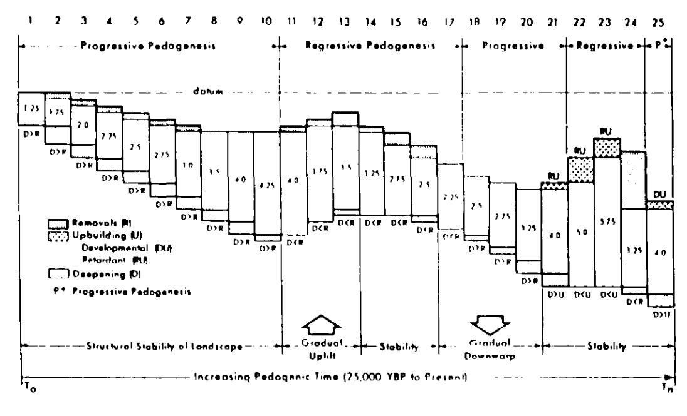

# (PART) Chapter 3: Soil Geomorphology? (WIP)

# Soil Geomophology

```{r setup, include=FALSE}
knitr::opts_chunk$set(include = FALSE, cache=TRUE)
```



```{python, echo = FALSE, eval = FALSE}
#Block 1: Installing LandLab (Only needs to be run once)

# Installs LandLab
!pip install landlab

#Prints the following statement below
print ('Landlab installed!')

# Restarts runtime to ensure that Landlab can be found by Python
exit()

```

```{python}
#Block 2: Importing Libraries and LandLab Components (Only needs to be run once)

###Libraries###
import numpy as np #Library for arrays
import matplotlib.pyplot as plt #Library for plotting
from landlab import RasterModelGrid #Component to make grids for landlab
from landlab.components import FlowAccumulator #Component to find drainage area
from landlab.components import FastscapeEroder #Component for fluvial processes
from landlab.components import LinearDiffuser #Component for hillslope processes
from landlab.components import DepressionFinderAndRouter #Component to route flow over depressions

print ('Libraries loaded sucessfully!')
```
