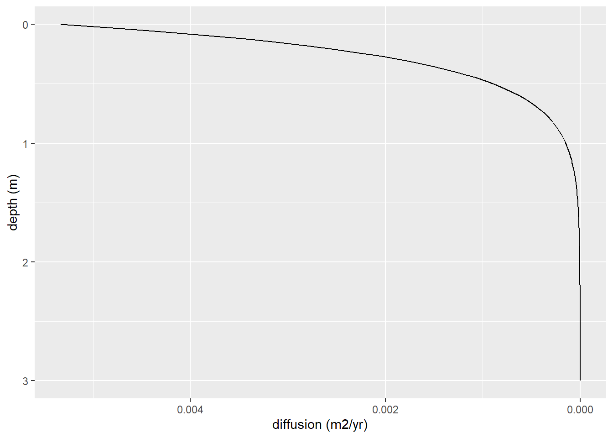
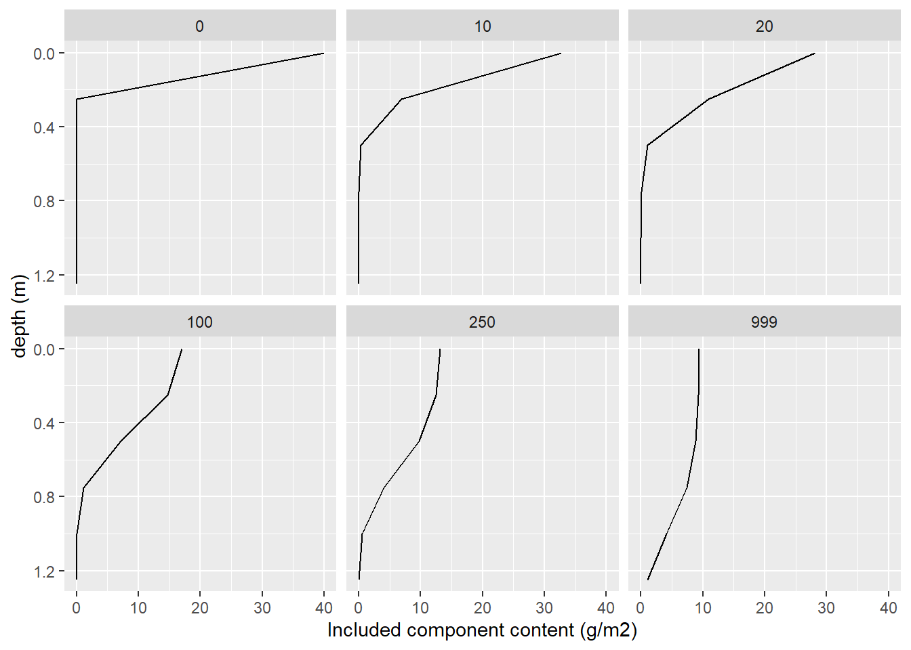
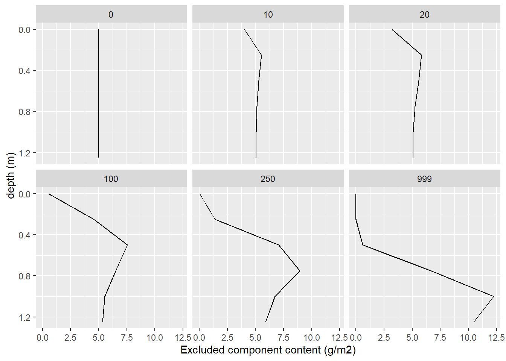
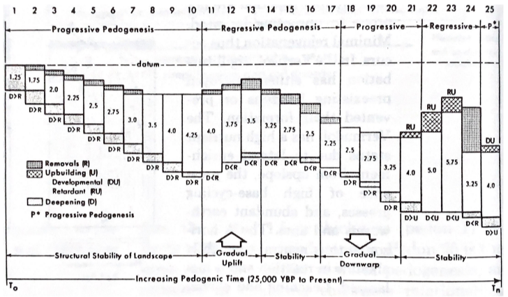

## Technical Resources

-   Markdown book: <https://bookdown.org/yihui/rmarkdown-cookbook/cache.html>

-   Bookdown book: <https://bookdown.org/yihui/bookdown/>

-   Setting up R and Git: <https://happygitwithr.com/>

-   Hava's book: <https://pages.github.umn.edu/blair304/cig-mgmt-data/index.html>

<!--chapter:end:index.Rmd-->

# About (start here)


```
## 
## Attaching package: 'dplyr'
```

```
## The following objects are masked from 'package:stats':
## 
##     filter, lag
```

```
## The following objects are masked from 'package:base':
## 
##     intersect, setdiff, setequal, union
```

```
## 
## Attaching package: 'rlang'
```

```
## The following object is masked from 'package:tinytex':
## 
##     check_installed
```


```
## [1] "Updated 11:00, 14 December, 2024"
```

This book is dedicated to my thoughts about animals as unintentional architects, or just animal architects. Through bioturbation, animals shape our soils and landscapes, but although I call them architects, their creations are not like ours. Yes, prairie gophers or night crawlers build homes to live and feed in, but the architecture I refer to is larger than any individual. It is the sum of generations of organisms. It is the ecological inheritance they create. It is order out of seemingly chaos. This idea is best illustrated through example, so take for example, Mima mounds.

{width="583"}

Mima mounds are a somewhat common landscape feature in the Western United states, they are thought to be formed by pocket gophers. A study by Cox and Allen (1987) revealed that in these landscapes, even though it is less energetically favorable, gophers preferentially move soil uphill. The authors suggests that because these soils are often wet, mounding soil increases aeration, plant growth, and provides safer burrowing space (Cox and Allen, 1984). So yes, locally gophers are mounding soil. But the size of these mounds (sometimes several meters) are beyond what a single gopher can produce. It is thus across generations and across the landscape we see structure and order out of individual behavior.

This book is organized loosely by my dissertation chapters. Chapter 1 is about invasive earthworms and their impact on soil erosion in Minnesota's forests. It is pratical research, and does/will include many of field methods, data analysis, and experimental design thoughts. Soil science, ecology, and hydrology are important topics. Chapter 2 is about bioturbation in the literature: how it's perceived, how it's modeled, how it's connected to soil and landscape formation. Much thought is given to the qualitative tools we use to describe and catagoize bioturbation and bioturbators. Chapter 3 is about modeling and using the lessons and data from prior chapters to create a quantiative framework for biological processes that drive soil and landscape formation.

## Table of Contents

**Animals as Agents of Heterogeneity and Homogeneity in Soil and Landscape Development**

Chapter 1: Earthworms and Soil Erosion

-   Section \@ref(hillslope-transects-erosion-pins-etc)
-   Section \@ref(imapct-of-vegetation-cover-on-erosion)

Chapter 2: Literature Review

-   Section \@ref(bioturbation-geo-ecology)
-   Section \@ref(bioturbation-modeling)

Chapter 3: Soil and Landscape Evolution Modeling

-   Section \@ref(soil-model-building)
-   Section \@ref(soil-geomophology)

<!--chapter:end:01_about.Rmd-->

# (PART) Chapter I: Earthworms and Soil Erosion {-}
# Hillslope Transects: Erosion Pins, etc.


<!--chapter:end:02_hillslope_transects.Rmd-->

# Imapct of Vegetation Cover on Erosion


<!--chapter:end:03_vegetation_cover.Rmd-->

# (PART) Chapter II: Literature Review {.unnumbered}

# Bioturbation Geo-ecology


The central idea of this section and chapter as a whole is to assess the role of animals in soil and landscape development. Specifically, to collect evidence for the statement:

> Animals unintentionally create heterogeneity and homogeneity in soil and landscape development.

It begs the question, what kind of framework, whether qualitative or quantitative, can we create to broadly understand the role of organisms in soil and landscape development? Hans Jenny (1941) provides an elegant framework to describe soil formation:

$$
S = f(cl, o, r, p, t)
$$

Where soil (S) is a function (f()) of climate (cl), organisms (o), relief (r), parent material (p), and time (t). Jenny's model is a powerful conceptual tool qualify the soil forming processes. Wilde (1946, p. 13) [found from Johnson & Watson-Stegner (1987)] suggests a slightly updated framework where prior factors are considered over time:

$$
S = f(cl, o, r, p)dt
$$

Jenny's model is factorial approach that describes the exogenous/environmental properties influencing soil development. However, a perhaps more useful tool for soil and landscape modeling (conceptually and literally) is a process-based approach. Jenny's original four variables can instead by described by several processes:

| Factor          | Example process                                   |
|-----------------|---------------------------------------------------|
| climate         | precipitation, eluviation, illuviation, advection |
| organisms       | bioturbation, diffusion                           |
| relief          | erosion, deposition, uplift                       |
| parent material | soil texture, weathering                          |

: cloprt factors to processes

In the context of a landscape where bioturbation is present and substantial, I propose the following approach:

$$S = f(D, E, P,\frac{dD}{dz},\frac{dP}{dz})dt
$$

Where D is diffusion or mixing, E is erosion, and P is soil production. Soil production and diffusion notably also change with profile depth, which depends on the parent material and organisms.

An alternative, more geomorphological approach (that requires a considerably long timescale) could integrate landscape-scale diffusion and stream-power-based erosion plus uplift variables into a clorpt model by the following thought process. On a landscape scale, erosion can be described by:

$$
ε = KA^mS^n+D\frac{d^2z}{dx^2}
$$Where erosion is equal to the sum of stream-power-based erosion and diffusion. Including uplift, we can express the standard landscape evolution equation:

$$
\frac{dz}{dt} = U - KA^mS^n-D\frac{d^2z}{dx^2}
$$

Over sufficiently long timescales, a system will eventually reach steady-state conditions, at which dz/dt is equal to zero. The above equation can then be rearranged to describe erosion rate as a function of U:

$$
U = KA^mS^n+D\frac{d^2z}{dx^2}
$$ U can then be substituted into the cloprt model:

$$
S = f(D, U, P,\frac{dD}{dz},\frac{dP}{dz})dt
$$

All of these equations provide only a conceptual model to identify the internal and external processes that are forming soil. They provide a lense through which soils and landscapes can be viewed. The rest of this section focuses on this qualitative side, whereas the following modeling sections represent a quantitative approach.

Goals:

1.  Qualitatively review the role of individual bioturbators as "unintentional architects" in landscape and soil development.
    -   How do bioturbators create structure and variability across the landscape?
2.  Complete a review of bioturbation rates, frequency, depth-dependence, and particle size limitations across organisms for model verification.

## Bioturbation Literature Review

### Gabet et al. (2003)

introduces a quantitative model for understanding sediment transport by tree throw. Gabet (2000) uses a similar approach to model hillslope morphology in gopher-activity dominated systems. The author suggests a new equation for hillslope evolution based on hillslope gradient:

$$
q_s(\frac{cm^3}{cm*a})=176(\frac{dz}{dx})^3-189(\frac{dz}{dz})^2+68(\frac{dz}{dx})
$$

The following equation represents a general framework for how bioturbators move soil (qs sediment flux) on a hillslope:

$$
q_s = \frac{vol}{event} * \frac{distance}{event} * \frac{events}{area} * \frac{events}{time}
$$

The authors in Gabet et al. (2003) also provide an overview of the role several bioturbators play in soil development and formation (physical disturbance of saprolie).

References:

-   Whitford 2000 - Ants are selective in the grain sizes they move, increases the heterogeneity of soil grain size

-   de Bruyn & Conacher 1994 - quantifies mass moved by termites

-   Reichman & Smith 1990 - vertebrate burrow diameter and characteristics

-   Smallwood & Morrison 1999 - burrow excavation dynamics of different gophers

-   Reichman et al 1982 - Lateral soil heterogeneity from burrows

-   Klaas et al. 2000 - Lateral soil heterogeneity from mounds

-   Heimsath et al. 1999 - Gophers converting bedrock to soil

-   Bowerman & Redente 1998 - role of bio-intrusion on waste site disruption

### Johnson & Watson-Stegner (1987)

provide a novel framework for soil evolution: one that describe soil as a function of progressive and regressive pedogensis. Progressive pedogensis includes horizonation processes, developmental up-building, and soil deepening. Regressive pedogensis includes haploidization processes, retardant up-building, and soil removal. Development up-building, versus retardant up-building, requires added material be pedogenetically assimilated into the profile. Often this depends on the rate of addition. The authors suggest positive and negative vectors for the following that together drive or oppose soil development:

> Horizonation ( + ) \<------------\> Haploidization ( - )

Evolution vectors:

1.  Removals (from one or more horizons) ( + / - )

2.  Translocations ( + / - )

3.  Transformations ( + / - )

4.  Feedback processes ( + / - )

5.  Bioturbation ( + / - )

6.  Upbuilding ( + / - )

7.  Deepening ( + )

8.  Removals ( - )

The authors also introduce the idea of internal feedback processes endogenic soil properties dominate over exogenic, environmental factors. For example, a petrocalcic horizon may develop in soil with a Ca rich parent material under an arid climate. This petrocalcic horizon, a product of soil genesis, impacts future development though leaching or bioturbation. A threshold was crossed that put the soil down a unique pedogenetic pathway.

The authors also reference Jenny's 1941 clopt model and use that elegant framework to describe their approach of soil genesis. It is a reminder of the utility of that basic equation and it's many applications.

References:

-   Yaalon (1971) and Ruellan (1971) soil feedback processes

-   Wilde (1946, p. 13) include dt in clorpt

-   Vreeken (1975a) soil landscape processes

-   Johnson et al. (1987b) dynamic rate model

$$
S = f(D, P, \frac{dD}{dt}, \frac{dP}{dt})
$$

-   Runge (1973) and Volobuyeve (1984) thermodyanics of soil end points

### References

Gabet, Emmanuel J., O.J. Reichman, and Eric W. Seabloom. “The Effects of Bioturbation on Soil Processes and Sediment Transport.” *Annual Review of Earth and Planetary Sciences* 31, no. 1 (May 2003): 249–73. <https://doi.org/10.1146/annurev.earth.31.100901.141314>.

Gabet, Emmanuel J. “Gopher Bioturbation: Field Evidence for Non-Linear Hillslope Diffusion.” *Earth Surface Processes and Landforms* 25, no. 13 (2000): 1419–28. [https://doi.org/10.1002/1096-9837(200012)25:13\<1419::AID-ESP1483.0.CO;2-1](https://doi.org/10.1002/1096-9837(200012)25:13%3C1419::AID-ESP148%3E3.0.CO;2-1).

Jenny, H. (1941). *Factors of Soil Formation A System of Quantitative Pedology*.  Dover Publications.

Johnson, D. L., and D. Watson-Stegner. “EVOLUTION MODEL OF PEDOGENESIS:” *Soil Science* 143, no. 5 (May 1987): 349–66. <https://doi.org/10.1097/00010694-198705000-00005>.

## Bioturbation Data-mining

See xls file.

### References

Cox, G. W., & Allen, D. W. (n.d.). Soil translocation by pocket gophers in a Mima moundfield.

Hansen, R. M. (n.d.). MOVEMENT OF ROCKS BY NORTHERN POCKET GOPI-IERS. 49.

Miller, M. A. (1957). Burrows of the Sacramento Valley pocket gopher in flood-irrigated alfalfa fields. Hilgardia, 26(8), 431–452. <https://doi.org/10.3733/hilg.v26n08p431>

Yeates, G. W., & Van Der Meulen, H. (1995). Burial of soil-surface artifacts in the presence of lumbricid earthworms. Biology and Fertility of Soils, 19(1), 73–74. <https://doi.org/10.1007/BF00336350>

## Notes to Self

-   Based on (Mudd and Yoo, 2010), a study on mineral age and weathering. Mixing plays an important role in the application of reservoir theory and in determining turnover time. A better understanding of the rate of mixing, depth of mixing, and method of transport (i.e. local vs non-local) migth be valuable.

-   How does the successional invasion of JW over European worms, through the displacement of Lumbricus terrestris, impact the type of mixing, I.e. local versus non local, and what are the consequences for clay movement in the soil?

### References

Mudd, Simon Marius, and Kyungsoo Yoo. “Reservoir Theory for Studying the Geochemical Evolution of Soils.” Journal of Geophysical Research: Earth Surface 115, no. F3 (2010). <https://doi.org/10.1029/2009JF001591>.

## 

<!--chapter:end:04_bioturbation_review.Rmd-->

# Bioturbation Modeling


The purpose of this section is to review the current state of the study and modeling of bioturbation.

The goals are to:

1.  Complete a review of the current bioturbation modeling landscape to answer the questions:
    -   What are the different approaches to modeling bioturbation or how can the current models be classified?
    -   What are the limitations or what is the applicability of theses models? What is their purpose?
    -   What spatial and temporal scale do models operate on? Soil profile or landscape? Decade or millennium?
2.  Compile annotated equations and variables used in modeling bioturbation.

### Model types

There are two general approaches to modeling bioturbation in terrestrial and aquatic environments: anomalous mixing and normal mixing (Michel et al., 2022). Anomalous mixing models are applied to simulating the individual trajectory of sediment-particles, and they capture the discontinuous movement of particles in "jumps" between periods of waiting. Jump length and waiting time are bioturbator-specific stochastic variables with a variance and a mean that can be simulated by random walk models (Meysman et al., 2010 in Michel et al., 2022). Of interest to this review, if simulation time and the number of translocation events are sufficiently large, anomalous mixing models coincide with the diffusive model (Michel et al., 2022). Further, "If σ and τ are finite... the ratio σ2/(2τ) is the biodiffusion coefficient. If moreover the mean μ of the jump-length distribution is non-zero, wb=μ/τ" (Michel et al., 2022).

> Sources to further look into: Meysman 2008: <https://doi.org/10.1016/j.gca.2008.04.023> Meysman 2010: <https://www.researchgate.net/publication/230736816_When_and_why_does_bioturbation_lead_to_diffusive_mixing> Marie 2007: <https://doi.org/10.1016/j.jembe.2006.10.052>

Normal mixing is described by a diffusion-advection equation and, as soil development occurs over very long timescales, is the focus of this review.

### Models

1.  Johnson et al. (2014) provides a simple diffusion model for change in a soil property, y, with time.

$$
\frac{dy}{dt} = \frac{d}{dz}(D(z)\frac{dy}{dz})
$$

the authors include an erosion factor, T. However, its use depends on the use of meteoric 10Be for estimating long-term erosion rates.

$$ \frac{dy}{dt} = \frac{d}{dz}(D(z)\frac{dy}{dz}) - T\frac{dY}{dz} $$

where

$$
D(z) = D(0)e^{-z/z_{b}}
$$

zb is the e-folding length scale (in meters)

2.  Example

$$f(k) = {n \choose k} p^{k} (1-p)^{n-k}$$

### References

Jarvis, N. J., Taylor, A., Larsbo, M., Etana, A., & Rosén, K. (2010). Modelling the effects of bioturbation on the re-distribution of 137Cs in an undisturbed grassland soil. European Journal of Soil Science, 61(1), 24–34. <https://doi.org/10.1111/j.1365-2389.2009.01209.x>

Johnson, D. L., Domier, J. E. J., & Johnson, D. N. (2005a). Animating the biodynamics of soil thickness using process vector analysis: A dynamic denudation approach to soil formation. Geomorphology, 67(1–2), 23–46. <https://doi.org/10.1016/j.geomorph.2004.08.014>

Johnson, D. L., Domier, J. E. J., & Johnson, D. N. (2005b). Reflections on the Nature of Soil and Its Biomantle. Annals of the Association of American Geographers, 95(1), 11–31. <https://doi.org/10.1111/j.1467-8306.2005.00448.x>

Johnson, M. O., Mudd, S. M., Pillans, B., Spooner, N. A., Keith Fifield, L., Kirkby, M. J., & Gloor, M. (2014). Quantifying the rate and depth dependence of bioturbation based on optically‐stimulated luminescence (OSL) dates and meteoric 10 Be. Earth Surface Processes and Landforms, 39(9), 1188–1196. <https://doi.org/10.1002/esp.3520>

Matisoff, G., Ketterer, M. E., Rosén, K., Mietelski, J. W., Vitko, L. F., Persson, H., & Lokas, E. (2011). Downward migration of Chernobyl-derived radionuclides in soils in Poland and Sweden. Applied Geochemistry, 26(1), 105–115. <https://doi.org/10.1016/j.apgeochem.2010.11.007>

Michel, E., Néel, M.-C., Capowiez, Y., Sammartino, S., Lafolie, F., Renault, P., & Pelosi, C. (2022). Making Waves: Modeling bioturbation in soils – are we burrowing in the right direction? Water Research, 216, 118342. <https://doi.org/10.1016/j.watres.2022.118342>

Román‐Sánchez, A., Laguna, A., Reimann, T., Giráldez, J. V., Peña, A., & Vanwalleghem, T. (2019). Bioturbation and erosion rates along the soil‐hillslope conveyor belt, part 2: Quantification using an analytical solution of the diffusion–advection equation. Earth Surface Processes and Landforms, 44(10), 2066–2080. <https://doi.org/10.1002/esp.4626>

Salvador-Blanes, S., Minasny, B., & McBratney, A. B. (2007). Modelling long-term in situ soil profile evolution: Application to the genesis of soil profiles containing stone layers. *European Journal of Soil Science*, *58*(6), 1535–1548. <https://doi.org/10.1111/j.1365-2389.2007.00961.x>

<!--chapter:end:05_model_review.Rmd-->

# (PART) Chapter 3: Soil and Landscape Evolution Modeling (WIP) {-}

# Soil Model Building


The purpose of this section is to create a quantitative framework, a model, to explore the relationship between bioturbation, erosion, and particle size distribution and their collective impact on soil profile and landscape development, across organisms.

To this end, the goal primary goal is to construct a model that integrates bioturbation, erosion, and particle size distribution on soil-profile and landscape scales. More specifically, to create a simple model, with a limited number of input parameters that can...

1.  Describe how bioturbation creates texture contrast in soils over time.
    1.  E.g. stoneline development or clay homogenization.
2.  Describe how erosion rate and particle-size sensitive erosion rate impact texture contrast development.
    1.  E.g. quantitatively model the dynamic denudation framework of Johnson et al. (2005a and 2005b).
3.  Describe how bioturbation drives soil texture variability across a landscape, including sediment supplied to streams.
4.  Accommodate changes in erosion and mixing rates at discrete time steps.
    1.  E.g. to simulate the impact of an invasive species or introduction of bioturbators.
5.  Represent a suite of bioturbators with unique particle size preferences and mixing rates and behaviors (see Chapter \@ref(review-animals-as-agents-of-heterogeneity-and-homogeneity-in-soil-and-landscape-development)).

## Clay and Soil Transport via Diffusion

The model is based on a layer system to approximate diffusion at depth. At each time step, the soil properties for each layer are calculated based on input parameters and the properties of the layer directly above and below. The model [currently] assumes steady state conditions: that erosion and soil formation are equivalent, regardless of soil depth. [Citation] says this is okay...

![Figure 1. Visualization of a single layer, i, and the upper and lower layers [this figure is a png now, build in r later if I want to keep]](images/clipboard-62785000.png){width="414"}


The first component is the change in diffusion with depth, a result of the decrease in bioturbation rate with depth noted by… (citations). Following Johnson et al. (2014), diffusion of bulk soil can be described by:

$$
D(z)=s e^{-z/b}
$$

Where D is bulk-soil diffusion (m2/yr), s is the surface diffusion rate (m2/yr) [think burial rate], z is depth (m), and b is a scaling factor related to organism-dependent bioturbation depth (m), assumed to be 0.28.


When considering the impact of diffusion on a single soil property [e.g. clay or coarse fragment content], a diffusion function can be applied with a concentration value to describe the flux (g/yr) through the profile. A diffusion function using these assumptions is approximately accurate for sufficiently long timescales (Mitchel et al. 2022) (see Chapter \@ref(model-types) for more details). This is based on the assumptions that spatially, mixing/burrow locations are randomly distributed, and all burrows are infilled with material from the layer directly above, thus upward and downward diffusion are equal. Flux between two layers can then be described by:

$$
V_{y, down}=D(z_i)(y_{i-1}-y_i)
$$

Where V~y~ is downward flux across layers (g/yr), i is the current layer, and y is the content of some soil property in the ith layer (g/m2). However, net flux into a layer requires consideration of both upward [i - 1] and downward [i + 1] movement, described by:

$$
V_{y, net}=D(z_i)(y_{i-a}-y_i) + D(z_i+h)(y_{i+1}-y_i)
$$

which is functionally similar to the diffusion equation:

$$
\frac{dy}{dt} = \frac{d}{dz}(D(z)\frac{dy}{dz})
$$

[note: bulk density should be included here as well, as a factor multiplied by the y term. it is left out for now for the sake of simplicity, and for the fact that the \# of layers in the model is undecided, and having data on both bulk density and bioturbation rate is somewhat rare]

Where h~i~ is layer thickness (m). If the soil property, y, is included in the bulk soil being diffused, over time, diffusion will homogenize layers, as y ‘flows’ from layers of high to low concentration. This model only considers local mixing, and does not account for material that is excavated from one layer and deposited on the surface. Jarvis et al. (2010) and Mastisoff et al. (2011) suggest an additional factor in the diffusion-advection equation to account for non-local mixing. Local plus non-local mixing is described by:

$$
placeholder.equation
$$

Where... Including non-local mixing complicates the model and requires more data on the behavior of bioturbators. In comparing models including and excluding non-local mixing, Jarvis et al. 2010 found models without non-local mixing underestimated surface translocation of particles (using 137Cs as tracer). Notably, the authors did not include erosion estimates in their model, which studies show is an important factor in the redistribution of material by bioturbation [citation]. Further study on the importance of modeling non-local mixing is required.

[note to self: burial versus erosion rate is a well-studied topic and is worth looking into here]

However, a primary interest of our model is the movement of material too large to be mixed by bioturbators, coarse fragments. Coarse fragments are included only in downward local soil movement. They move downwards to infill where material is excavated but are too large to be excavated themselves. Ignoring non-local and upward local mixing, flux of coarse fragments can be simplified to:

$$
V_{S, net}=D(z_i)(S_i) + D(z_i+h)(S_{i+1}-S_i)
$$

Where S is the concentration of material of a greater size class than movable by present bioturbators. At the top and bottom of the profile, the above diffusion equations are adjusted to be zero.


``` r
#'###################### [creating a data frame below] #######################

# number of time steps
rep_times = 1000

# number of years per time step
rep_years = 10

# build a data frame
df = data.frame(time_step = rep(c(0:(rep_times - 1)), each = 4),
                index = rep(c("z", "h", "clay", "stones"), times = rep_times),
                "A" = 0, 
                "B" = 0, 
                "C" = 0, 
                "D" = 0, 
                "E" = 0,
                "F" = 0)

#split data frame into multiple based on index column. names accordingly
df2 = df %>% group_by(index) %>% group_split(.keep = FALSE) %>% set_names(nm = c("z", "h", "clay", "stones"))

#assign the top depths of each layer
za = c(rep(0, times = rep_times))
zb = c(rep(0.25, times = rep_times))
zc = c(rep(0.5, times = rep_times))
zd = c(rep(1, times = rep_times))
ze = c(rep(1.5, times = rep_times))
# zf_fun bottom depth, not a layer (this is needed, as zf is is what the D functions use to assess if zi + hi = 0)
zf_fun = 1.75
zf = c(rep(zf_fun, times = rep_times))

#calculate h's, layer thickness
ha = zb - za
hb = zc - zb
hc = zd - zc
hd = ze - zd
he = zf - ze

#input parameters into data frames
df2[["z"]][c(2, 3, 4, 5, 6)] = data.frame(za, zb, zc, zd, ze)
df2[["h"]][c(2, 3, 4, 5, 6)] = data.frame(ha, hb, hc, hd, he)
#below is the starting clay and stone content of each layer, A:E
df2[["clay"]][c(2, 3, 4, 5, 6)] = data.frame(20, 20, 40, 20, 20)
df2[["stones"]][c(2, 3, 4, 5, 6)] = data.frame(5, 5, 5, 5, 5)

#'###################### [model calculations below] #######################

# define diffusion (bioturbation) function (if statements needed for top and bottom layers) (m/yr)
Dz <- function(z) {
  if(z == 0) {
    0 # could an erosion factor be included here ??????
  } else {
    if(z == zf_fun) {
      0 # could a soil production factor be included here ??????
    } else {
      #' [diffusion function defined here]
      #9.81 * 10^-5 * exp(-z/0.28) #linear (Johnson et al., 2014)
      0.005334 * exp(-z/0.28) #exponential (Johnson et al., 2014) for eq. (Darwin 1881) for intercept
      #6.9 * 10^-5 + -1.06 * 10^-4 * z #exponential (Johnson et al., 2014)
      #0.0426 #earthworms (Yeates et a.l, 1995)
      #0.005334 #earthworms (Darwin 1881)
    }
  }
}

#' define function that calculates net [clay-diffusion] (g/m/yr) into/out of ith layer
clay_diff_fun <- function(Ch, Ci, Cj, zi, hi) {
  (Dz(z = zi) * (Ch - Ci) +
     (Dz(z = zi + hi) * (Cj - Ci)) )
}

#' define function that calculates net [stones-diffusion] (g/m/yr) into/out of ith layer
stones_diff_fun <- function(Sh, Si, Sj, zi, hi) {
  (Dz(z = zi) * Sh -
     (Dz(z = zi + hi) * Si) )
}


# for loop that fills data frame with diffusion-calculated clay contents
for(crow in 2:(rep_times)) {
  for(ccol in 2:6) {
    # apply clay-diffusion function
    df2[["clay"]][crow, ccol] = 
      df2[["clay"]][crow - 1, ccol] +
      rep_years * 
      clay_diff_fun(df2[["clay"]][crow - 1, ccol - 1],
                   df2[["clay"]][crow - 1, ccol],
                   df2[["clay"]][crow - 1, ccol + 1],
                   df2[["z"]][crow, ccol],
                   df2[["h"]][crow, ccol])
    # apply stones-diffusion function
    df2[["stones"]][crow, ccol] = 
      df2[["stones"]][crow - 1, ccol] +
      rep_years * 
      stones_diff_fun(df2[["stones"]][crow - 1, ccol - 1],
                    df2[["stones"]][crow - 1, ccol],
                    df2[["stones"]][crow - 1, ccol + 1],
                    df2[["z"]][crow, ccol],
                    df2[["h"]][crow, ccol])
  } 
}

#'###################### [plotting below] #######################

#' [creating a dataframe to plot from]
# convert df2 dataframes to long format, one data frame for each clay, stones, and z
df2_clay_long <- df2[["clay"]] %>% 
  pivot_longer(cols = c("A", "B", "C", "D", "E"), names_to = "layer") %>% 
  mutate(F = c(1:(5*rep_times)), .keep = "unused")
df2_stones_long <- df2[["stones"]] %>% 
  pivot_longer(cols = c("A", "B", "C", "D", "E"), names_to = "layer") %>% 
  mutate(F = c(1:(5*rep_times)), .keep = "unused")
# combine long df2 dataframes into one for plotting 
df2_z_long <- df2[["z"]] %>% 
  pivot_longer(cols = c("A", "B", "C", "D", "E"), names_to = "layer") %>% 
  mutate(F = c(1:(5*rep_times)), .keep = "unused")

# combine and filter the long df2's and select for only key time steps
df2_long_join1 <- left_join(df2_clay_long, df2_z_long, suffix = c(".clay", ".z"), by = "F")
df2_long_join2 <- left_join(df2_long_join1, df2_stones_long, by = "F")

df2_long <- df2_long_join2 %>% 
  select(time_step.clay, layer.clay, value.clay, value.z, value) %>% 
  rename(time_step = time_step.clay, layer = layer.clay, value.stones = value) %>% 
  filter(time_step == 0 | 
           time_step == (rep_times / 100) | 
           time_step == (rep_times / 50) | 
           time_step == (rep_times / 10) | 
           time_step == (rep_times / 4) |
           time_step == (rep_times - 1))

#plot stones
ggplot(data = df2_long, mapping = aes(y = value.z,
                                      x = value.stones, 
                                      group = time_step)) + 
  geom_line(orientation = "y") +
  scale_y_reverse(name = "depth (m)") +
  scale_x_continuous(name = "stones content (g/m2)") +
  facet_wrap(~time_step) +
  ggtitle("Stone movement over time"
          , subtitle = "1 timestep = 10 years")
```



``` r
#plot clay
ggplot(data = df2_long, mapping = aes(y = value.z,
                                      x = value.clay, 
                                      group = time_step)) + 
  geom_line(orientation = "y") +
  scale_y_reverse(name = "depth (m)") +
  scale_x_continuous(name = "clay content (g/m2)") +
  facet_wrap(~time_step) +
  ggtitle("Clay movement over time",
          subtitle = "1 timestep = 10 years")
```



``` r
#' [basic plot, stone content over time for each layer]
ggplot(data = df2[["stones"]]) +
  geom_line(mapping = aes(y = A, x = time_step, color = "green")) +
  geom_line(mapping = aes(y = B, x = time_step, color = "red")) +
  geom_line(mapping = aes(y = C, x = time_step, color = "blue")) +
  geom_line(mapping = aes(y = D, x = time_step, color = "orange")) +
  geom_line(mapping = aes(y = E, x = time_step, color = "purple"))
```



### Erosion and Soil Formation

WIP

At the top, an erosion factor is included. Bulk density is assumed to be consistent throughout the profile.

## References
Darwin, Charles. The Formation of Vegetable Mould through the Action of Worms: With Observations on Their Habits. 1st ed. Cambridge University Press, 1881. https://doi.org/10.1017/CBO9780511703850.

Johnson, Michelle O., Simon M. Mudd, Brad Pillans, Nigel A. Spooner, L. Keith Fifield, Mike J. Kirkby, and Manuel Gloor. “Quantifying the Rate and Depth Dependence of Bioturbation Based on Optically‐stimulated Luminescence (OSL) Dates and Meteoric 10 Be.” Earth Surface Processes and Landforms 39, no. 9 (July 2014): 1188–96. https://doi.org/10.1002/esp.3520.

Yeates, G. W., and H. Van Der Meulen. “Burial of Soil-Surface Artifacts in the Presence of Lumbricid Earthworms.” Biology and Fertility of Soils 19, no. 1 (January 1995): 73–74. https://doi.org/10.1007/BF00336350.

Jarvis, N. J., A. Taylor, M. Larsbo, A. Etana, and K. Rosén. “Modelling the Effects of Bioturbation on the Re-Distribution of 137Cs in an Undisturbed Grassland Soil.” European Journal of Soil Science 61, no. 1 (2010): 24–34. https://doi.org/10.1111/j.1365-2389.2009.01209.x.

Matisoff, Gerald, Michael E. Ketterer, Klas Rosén, Jerzy W. Mietelski, Lauren F. Vitko, Henning Persson, and Edyta Lokas. “Downward Migration of Chernobyl-Derived Radionuclides in Soils in Poland and Sweden.” Applied Geochemistry 26, no. 1 (January 2011): 105–15. https://doi.org/10.1016/j.apgeochem.2010.11.007.

Meysman, Filip J.R., Volodymyr S. Malyuga, Bernard P. Boudreau, and Jack J. Middelburg. “A Generalized Stochastic Approach to Particle Dispersal in Soils and Sediments.” Geochimica et Cosmochimica Acta 72, no. 14 (July 2008): 3460–78. https://doi.org/10.1016/j.gca.2008.04.023.

<!--chapter:end:06_model_building.Rmd-->

# Soil Geomophology


Landlab notebook <https://colab.research.google.com/drive/1tJ3Fw6BJP_bqvTImmXFxgWCYR-yI1T7y?usp=sharing>



<!--chapter:end:08_soil_geomorphology.Rmd-->

# (APPENDIX) Appendix {-}

# Gamma Detectors


### Detector specs


|detector.name |detector.model |serial.number |
|:-------------|:--------------|:-------------|
|Alice         |BE3825         |13263         |
|Sweepea       |BE3825         |8970          |
|Popeye        |GC4018         |9944          |
|Oliveoyl      |GCW4023        |1570          |

<!--chapter:end:97_gamma_detectors.Rmd-->

# Radionuclide Sampling Protocol


## Background

Measurement of 137Cs and 210Pb inventories is a well-established method of measuring erosion, bioturbation, and sediment transport. They represent a relatively fieldwork-light, although technical, approach to measuring soil erosion across decade to century timescales. The core of the method is comparing 137Cs and/or 210Pb inventories between samples taken at erosional/depositional sites and an undisturbed reference site. Samples with a lesser inventory than the reference site reflect erosion, and cores with a greater inventory reflect deposition.

The International Atomic Energy Agency provides general guidelines for 137Cs and 210Pb use in “Guidelines for using fallout radionuclides to assess erosion and effectiveness of soil conservation strategies” 2014. In short, this method involves A) sampling an undisturbed reference site and an erosional/depositional site, B) preprocessing and analyzing samples for 137Cs and 210OPb activity in a lab on a germanium detector, and C) employing a model to convert radioisotope inventories to erosion rates. The application of this method depends on three assumptions on the behavior of these radioisotopes in the environment (IAEA, 2014):

1.  137Cs and 210Pb are spatially uniform across the study area.

2.  137Cs and 210Pb are rapidly and irreversibly absorbed to soil particles, limiting their movement to physical transport.

3.  137Cs and 210Pb depth distributions are equivalent, excluding physical movement of soil particles, between reference and sample sites.

However, as many authors explore, these assumptions are imperfect and demand the user consider multiple potential sources of error (Baccolo et al., 2023; Nolin et al., 1993; Parsons & Foster, 2011; Mabit et al., 2013). Following is a discussion of ‘areas of concern’ and how they are addressed in the literature and in review:

-   [Reference site selection]

-   [Reference site sampling]

-   [Erosion sample position]

-   [Erosion site sampling]

-   [Erosion sample positioning]

-   [Sample characteristics]

-   [Bioturbation and nuclide distribution]

-   [Reference site selection]

Reference site selection can be challenging, especially in study areas with unknown or highly variable land use. The IAEA guidelines provide the following criteria for reference site selection: the site should be 1) undisturbed and under consistent land-use since 1950, 2) within \~1 km of the sample area, and 3) not experiencing erosion or deposition. Hancock et al. 2008, additionally suggests selecting a reference site where precipitation, the driving factor of 137Cs/excess 210Pb deposition (IAEA, 2014), is expected to be similar to the erosional/depositional area. Additionally, if the reference site is in a forest, a larger number of cores should be taken to account for greater heterogeneity (IAEA, 2014). Cores should also be taken avoiding trees and areas of concentrated stemflow (Nolin et al., 1993).

### Reference site sampling

The assumption of an even distribution of fallout across the landscape is limited by several sources of small-scale variability. These include spatial differences in the soil properties that control 137Cs absorption, interception of depositional rainfall by vegetation, uptake of radioisotopes by plants, and animal or human disturbance (IAEA, 2014; Parsons & Foster, 2011; Mabit et al., 2013). To broadly account for this variability, taking replicate cores across the reference site is widely applied. The IAEA guidelines recommend a minimum of 10 - 15 samples per reference site. For a forested site, Nolin et al. 1993 provides equations to estimate the number of samples needed to achieve a specific allowable error and confidence level.

However, analyzing 10 – 15 samples can be expensive and time consuming, so many studies bulk reference cores after segmentation to reduce the number of samples to analyze (Arata et al., 2016; Baccolo et al., 2023; Hancock et al., 2008; Nolin et al., 1993). Bulking is also suggested by the IAEA. The downside to bulking samples, however, is the loss of data on the variability of radioisotope inventories across the reference site. Cost, time, and statistical rigor must all be considered when deciding to bulk or not bulk samples.

### Erosion sample positioning

Placement of cores along a hillslope is important to consider before sampling. The IAEA suggests, for a slope with minimal horizontal complexity, a minimum of 3 equally spaced samples along a transect. This is a common approach in the literature, followed by Elliott et al., 1989; Hancock et al., 2008; Nolin et al., 1993; and Wallbrink & Murray, 1996. For more complex slopes, additional cores from additional transects should be taken, but both strategies are compatible with most currently available inventory conversion models (IAEA, 2014). Additionally, there are newer models that allow for greater flexibility in sampling strategy and have demonstrated success under a variety of conditions (Baccolo et al., 2023; Arata et al., 2016). Given relatively equal core spacing along a transect, it also is worth considering what is being measured at each point: e.g. the magnitude of erosion and/or deposition. Elliott et al., 1989, provides a theoretical model for this, depicted below. However, this is dependent on the purpose of the study.

### Erosion site sampling

Accounting for small-scale variability is also important for erosion site sampling, but there is disagreement in the literature about sample numbers. It is relatively common to collect 1 - 5 soil cores at each erosion sampling point (Arata et al., 2016; Baccolo et al., 2023; Hancock et al., 2008; Nolin et al., 1993). This is also in agreement with the IAEA guidelines. However, Parsons & Foster 2011 raises the point that the small-scale variability in 137Cs distribution is not exclusive to the reference site, and that a similar number of replicates, 10 - 15, should be taken from each sampling point. Jarvis et al., 2010 employs this larger number of samples per site, although the focus of that study is not soil erosion. It is worth noting, the above studies with smaller core numbers do present compelling data, and some with comparable measurements by other methods.

### Sample characteristics

Finally, it is important to consider the characteristics of individual cores and samples (cores after bulking or segmenting, final products to be analyzed). For both reference and erosion sites, core depth and radius are important to consider. The IAEA provides guidelines for both. The standard recommendation is a corer diameter of 7 – 10 cm and a total depth of 30cm for reference and erosional sites and 40 – 60 cm for depositional sites. For the most part, this is consistent in the literature (Elliott et al., 1989; Hancock et al., 2008; Nolin et al., 1993; Baccolo et al., 2023; Arata et al., 2016; and Wallbrink & Murray, 1996). However, when many replicates are being taken and bulked, one may consider using a corer of a smaller diameter. Minimizing sample volume makes easier sample processing and more consistent homogenization (Nate Lund, personal observation).

In addition, for reference sites, the size of reference core segments is another consideration. Reference cores are segmented for three reasons: (1) to establish the reference inventory, (2) determine the depth profile of 137Cs and 210Pb (necessary for conversion models), and (3) determine the maximum depth of 137Cs and 210Pb activity to inform sampling depth (IAEA, 2014). The IAEA broadly recommends 2 – 5 cm. Smaller segments provide a more detailed activity-depth profile, but require more samples be analyzed.

### Bioturbation and nuclide distribution

Earthworm bioturbation is important factor to consider when converting from radioisotope inventories to erosion and deposition rates. Literature shows that earthworms have a significant impact on the 137Cs distribution in the profile—flattening the exponential decay expected under natural conditions (Jarvis et al., 2010; Tyler et al., 2001; VandenBygaart et al., 1998). VandenBygaart et al., 1998, also suggests a relationship between earthworm abundance and 137Cs redistribution. The consequences of this redistribution are twofold. One, bioturbation by deep-burrowing Lumbricus terrestris may extend the depth of 137Cs distribution beyond 30cm and require deeper sampling. Two, continuous mixing dilutes 137Cs concentration in eroding sediments, which without correction, may result in an underestimation of erosion rates.

### Radioisotope Sampling Protocol for Jumping Worm Erosion Project

## Protocol

(Adapted from IAEA guidelines with additions from the literature) 137Cs and 210Pb sampling has two components: establishing the reference inventory and sampling for erosion and deposition along a hillslope transect. In our study, the reference inventory will be established from two sites: one at the Minnesota Landscape Arboretum and another at Lake Rebecca. The reference inventory will be composed of 24 cores taken to a depth of 30 cm and segmented at 5 cm increments. 5 cm segments from all 12 cores will be bulked for a total of 6 reference inventory samples per site: 0-5cm, 5-10cm, 10-15cm, 15-20cm, 20-25cm, and 25-30cm. 7 erosion samples will be taken along a hillslope transect on the summit, shoulder, backslope, footslope and toeslope. Six 30 cm cores will be taken on each contour and bulked in entirety. 264 total cores will be taken for 54 samples to be analyzed on the gamma detector. Following is the sampling strategy model for a single reference and erosion site.

### Materials

-   Soil corer: ≥30 cm depth, 2.5 cm diameter

-   Sample bags

-   Towel and brush

-   Bucket (optional)

-   Sharpie

-   Ruler (cm)

-   Flags

-   GPS

### Protocol (adapted from IAEA guidelines)

1.  Prior to sampling, either just in the field or using GIS, determine and flag the location of all points you will take cores from. Reference diagram above.

Note: Samples should be taken avoiding trees, large roots, downed logs, or any other large disturbance.

2.  Label all bags before sampling.
3.  Insert the soil corer vertically, not perpendicular to the hillslope, down to 30cm.
4.  Pull the corer straight up, and immediately turn the corer sideways to prevent soil from falling out. For very loose or sandy soils, you may need to place a hand at the mouth of the core as it is pulled out.
5.  For reference site replicates, either place the core in the gutter to segment, or segment in the corer, whichever is more convenient.
6.  If possible, sharpie depth increments onto the corer before you start.
7.  Store cores in labeled bags as soon as possible.
8.  Using the towel and brush, clean out the corer between samples—especially the mouth of the corer. It is not necessary to clean between sample replicates. But it is necessary to clean between reference replicates.

Repeat.

[**References**]

Updated 9/18/2024

Arata, L., Meusburger, K., Frenkel, E., A’Campo-Neuen, A., Iurian, A. R., Ketterer, M. E., Mabit, L., & Alewell, C. (2016). Modelling Deposition and Erosion rates with RadioNuclides (MODERN)—Part 1: A new conversion model to derive soil redistribution rates from inventories of fallout radionuclides. Journal of Environmental Radioactivity, 162–163, 45–55. <https://doi.org/10.1016/j.jenvrad.2016.05.008>

Baccolo, G., El Khair, D. A., Nastasi, M., Sisti, M., Ferrè, C., Alewell, C., & Comolli, R. (2023). 210Pbxs. Is a viable alternative to 137Cs for tracing soil redistribution in mountain pastures affected by heterogeneous Chernobyl fallout. Earth Surface Processes and Landforms, 48(4), 708–720. <https://doi.org/10.1002/esp.5512>

Crossley, D. A., Reichle, D. E., & Edwards, C. A. (1971). Intake and turnover of radioactive cesium by earthworms (Lumbricidae). Pedobiologia, 11(1), 71–76. [https://doi.org/10.1016/S0031-4056(23)00446-8](https://doi.org/10.1016/S0031-4056(23)00446-8)

Elliott, G. L., Campbell, B. L., & Shelly, D. J. ; C. (1989). A caesium-137-sediment hillslope model with tests from south-eastern Australia. Zeitschrift Für Geomorphologie, 33(2), 235–250.

Hancock, G. R., Loughran, R. J., Evans, K. G., & Balog, R. M. (2008). Estimation of Soil Erosion Using Field and Modelling Approaches in an Undisturbed Arnhem Land Catchment, Northern Territory, Australia. Geographical Research, 46(3), 333–349. <https://doi.org/10.1111/j.1745-5871.2008.00527.x>

International Atomic Energy Agency & Joint FAO/IAEA Division of Nuclear Techniques in Food and Agriculture. (2014). Guidelines for using fallout radionuclides to assess erosion and effectiveness of soil conservation strategies.

Janssen, M. P. M., Glastra, P., & Lembrechts, J. F. M. M. (1996). Uptake of cesium-134 by the earthworm species Eisenia foetida and Lumbricus rubellus. Environmental Toxicology and Chemistry, 15(6), 873–877. <https://doi.org/10.1002/etc.5620150608>

Jarvis, N. J., Taylor, A., Larsbo, M., Etana, A., & Rosén, K. (2010). Modelling the effects of bioturbation on the re-distribution of 137Cs in an undisturbed grassland soil. European Journal of Soil Science, *61*(1), 24–34. <https://doi.org/10.1111/j.1365-2389.2009.01209.x>

Mabit, L., Benmansour, M., Abril, J. M., Walling, D. E., Meusburger, K., Iurian, A. R., Bernard, C., Tarján, S., Owens, P. N., Blake, W. H., & Alewell, C. (2014). Fallout 210Pb as a soil and sediment tracer in catchment sediment budget investigations: A review. Earth-Science Reviews, 138, 335–351. <https://doi.org/10.1016/j.earscirev.2014.06.007>

Mabit, L., K. Meusburger, E. Fulajtar, and C. Alewell. “The Usefulness of 137Cs as a Tracer for Soil Erosion Assessment: A Critical Reply to Parsons and Foster (2011).” Earth-Science Reviews 127 (December 2013): 300–307. <https://doi.org/10.1016/j.earscirev.2013.05.008>

Nolin, M. C., Cao, Y. Z., Coote, D. R., & Wang, C. (1993). Short-range variability of fallout ^137^ Cs in an uneroded forest soil. Canadian Journal of Soil Science, 73(3), 381–385. <https://doi.org/10.4141/cjss93-040>

Parsons, A. J., & Foster, I. D. L. (2011). What can we learn about soil erosion from the use of 137Cs? Earth-Science Reviews, 108(1–2), 101–113. <https://doi.org/10.1016/j.earscirev.2011.06.004>

Tyler, A. N., Carter, S., Davidson, D. A., Long, D. J., & Tipping, R. (2001). The extent and significance of bioturbation on 137Cs distributions in upland soils. CATENA, 43(2), 81–99. [https://doi.org/10.1016/S0341-8162(00)00127-2](https://doi.org/10.1016/S0341-8162(00)00127-2)

VandenBygaart, A. J., Protz, R., Tomlin, A. D., & Miller, J. J. (1998). 137Cs as an indicator of earthworm activity in soils. Applied Soil Ecology, 9(1–3), 167–173. [https://doi.org/10.1016/S0929-1393(98)00071-7](https://doi.org/10.1016/S0929-1393(98)00071-7)

Wallbrink, P. J., & Murray, A. S. (1996). Determining Soil Loss Using the Inventory Ratio of Excess Lead-210 to Cesium-137. Soil Science Society of America Journal, 60(4), 1201–1208. <https://doi.org/10.2136/sssaj1996.03615995006000040035x>

<!--chapter:end:98_radionuclide_protocol.Rmd-->

