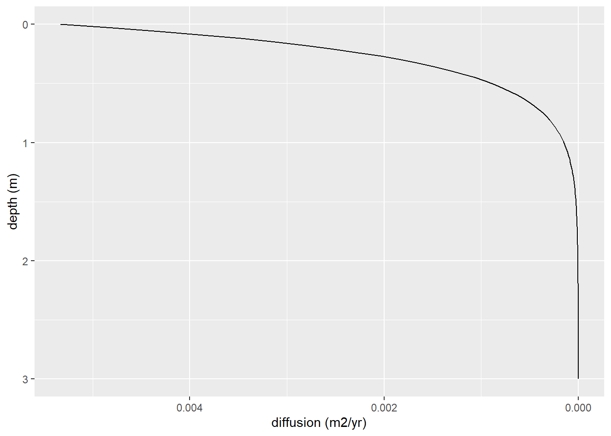

# Numerical Model Building


The purpose of this section is to create a quantitative framework, a model, to explore the relationship between bioturbation, erosion, and particle size distribution and their collective impact on soil profile and landscape development.

To this end, the goal primary goal is to create a simple model, with a limited number of input parameters that can...

1.  Describe how bioturbation creates texture contrast in soils over time.
    1.  E.g. stoneline development or clay movement.
2.  Describe how erosion rate and particle-size sensitive erosion rate impact texture contrast development.
    1.  E.g. quantitatively model the dynamic denudation framework of Johnson et al. (2005a and 2005b).
3.  Describe how bioturbation drives soil texture variability across a landscape, including sediment supplied to streams.
4.  Accommodate changes in erosion and mixing rates at discrete time steps.
    1.  E.g. to simulate the impact of an invasive species or introduction of bioturbators.
5.  Represent a suite of bioturbators with unique particle size preferences and mixing rates and behaviors.

## Soil Transport via Diffusion-Advection

The model is based on a layer system to approximate biodiffusion at depth. The number of layers (currently only 5), layer thickness, and profile depth are user-input. At each time step, the soil properties for each layer are calculated based on input parameters and the properties of the layer directly above and below. The model currently assumes steady state conditions: that erosion and soil formation are equivalent, regardless of soil depth, and thus that soil thickness remains constant over time. [citation about steady state] says this is okay... The model is currently integrates local and non-local mixing to simulate two soil properties: one that is included in diffused material (e.g. clay) and one that is excluded from diffused material (e.g. coarse fragments).

{width="414"}

The first component is the change in diffusion with depth as a result of decreased in organisms activity as noted by many authors [citation]. Two similar functions are used for this purpose: one for local and one for non-local mixing. Following Johnson et al. (2014), this relationship can be described by:

$$
D(z)=s e^{-z/b}
$$

Where D is bulk-soil diffusion (m2/yr), s is the surface diffusion rate (m2/yr), z is depth (m), and b is the e-folding length scale related to organism-dependent bioturbation depth (m) [assumed to be 0.28].


When considering the impact of diffusion on a single soil property, a biodiffusion function can be applied with a concentration value to describe the flux (g/yr) through the profile. Diffusion-advection is a relatively substantial simplification of the bioturbation process where periods of sediment inactivity are interuppted by trans location events. However, prior studies show that the application of a diffusion-advection equation is appropraite if simulation time and the number of translocation events are sufficiently large (Mitchel et al. 2022). Flux between two layers can then be described by:

$$
V_{y, down}=D(z_i)(y_{i-1}-y_i)
$$

Where V~y~ is downward flux across layers (g/yr), i is the current layer, and y is the content of some soil property in the ith layer (g/m2). However, net flux into a layer requires consideration of both upward [i - 1] and downward [i + 1] movement, described by:

$$
V_{y}=D(z_i)(y_{i-1}-y_i) + D(z_i+h_i)(y_{i+1}-y_i)
$$

[note: bulk density is implicitly included in the y term, but might not always be]

Where h~i~ is the thickness of layer i (m). This is functionally similar to the diffusion-advection equation, $\frac{dy}{dt} = \frac{d}{dz}(D(z)\frac{dy}{dz})$, but in a more easily R-model-able format. However, because diffusion will be zero at the top and bottom of the soil profile, it requires a peicewise definition of D(z):

\begin{equation}
D(z) =
  \left\{\begin{array}{lr}
     0, & z = 0 \\
     s e^{-z/b}, & 0 < z < f \\
     0, & z = f 
  \end{array}\right.
\end{equation}

This model only considers only local mixing, and does not account for material that is excavated from one layer and deposited on the soil surface. Non-local mixing represnets a considerable displacement of material and has considerable impacts on surface material contents (Jarvis et al. 2010; Mastisoff et al. 2011). An additional piecewise diffusion function, $D_l(z)$, is defined for non-local mixing to allow a different diffusion-depth relationship than that of local mixing.

\begin{equation}
D_l(z) =
  \left\{\begin{array}{lr}
     s e^{-z/b}, & z > 0 \\
     \int_{0}^{f}D(z_l)dz*\frac{1}{n}\sum_{i=1}^{n}y_i & z = 0 \\
  \end{array}\right.
\end{equation}

Local plus non-local mixing is described by:

$$
V_{y}=D(z_i)(y_{i-1}-y_i) + D(z_i+h)(y_{i+1}-y_i) \\+ D_l(z_i)(y_{i-1})-D_l(z_i+h_i)(y_i)
$$

Including non-local mixing complicates the model and requires more data on the behavior of bioturbators. In comparing models including and excluding non-local mixing, Jarvis et al. 2010 found models without non-local mixing underestimated surface translocation of particles (using 137Cs as tracer). Notably, the authors did not include erosion estimates in their model, which studies show is an important factor in the redistribution of material by bioturbation [citation]. Further study on the importance of modeling non-local mixing is required.

[note to self: burial versus erosion rate is a well-studied topic and is worth looking into here]

However, a primary interest of our model is the movement of material too large to be mixed by bioturbators, coarse fragments. Coarse fragments are included only in downward local soil movement. They move downwards to infill where material is excavated but are too large to be excavated themselves. Ignoring non-local and upward local mixing, flux of coarse fragments can be simplified to:

$$
V_{S, net}=D(z_i)(S_i) + D(z_i+h)(S_{i+1}-S_i)
$$

Where S is the concentration of material of a greater size class than movable by present bioturbators. At the top and bottom of the profile, the above diffusion equations are adjusted to be zero.

[input parameter table here]

### Model 1: Diffusion (local mixing) of included and excluded components.


``` r
#'###################### [creating a data frame] #######################

#' [set] number of time steps
time_steps = 1000

#' [set] number of years per time step
step_years = 10

# build a data frame
df = data.frame(time_step = rep(c(0:(time_steps - 1)), each = 4),
                index = rep(c("z", "bd", "inc", "exc"), times = time_steps),
                "A" = 0, 
                "B" = 0, 
                "C" = 0, 
                "D" = 0, 
                "E" = 0,
                "F" = 0,
                "bot" = 0)
#' [set] layer thickness (m)
h <- 0.25

#split data frame into multiple based on index column. names accordingly
df2 = df %>% group_by(index) %>% group_split(.keep = FALSE) %>% set_names(nm = c("z", "bd", "inc", "exc"))

# input the top depths of each layer into data frame
df2[["z"]][c(2, 3, 4, 5, 6, 7, 8)] = data.frame(0, h, h*2, h*3, h*4, h*5, h*6)

#' [set] layer bd into data frame, A:F
df2[["bd"]][c(2, 3, 4, 5, 6, 7)] = data.frame(1, 1, 1, 1, 1, 1)

#' [set] starting included and excluded components of each layer, A:F
df2[["inc"]][c(2, 3, 4, 5, 6, 7)] = data.frame(40, 0, 0, 0, 0, 0)
df2[["exc"]][c(2, 3, 4, 5, 6, 7)] = data.frame(5, 5, 5, 5, 5, 5)

#'###################### [defining functions] #######################

# define diffusion (bioturbation) function (if statements needed for top and bottom layers) (m/yr)
Dz <- function(z) {
  0.005334 * exp(-z/0.28) # exponential (Johnson et al., 2014) for eq. (Yeates et a.l, 1995) for intercept
  # 6.9 * 10^-5 + -1.06 * 10^-4 * z # linear
}

# diffusion w/ depth function plotting
eq = function(z){0.005334 * exp(-z/0.28)}
ggplot(data.frame(z = c(0, 3)), aes(x = z)) +
  stat_function(fun = eq) +
  scale_y_reverse(name = "diffusion (m2/yr)") +
  scale_x_reverse(name = "depth (m)") +
  coord_flip()
```



``` r
# define function that calculates local inc-diffusion (g/m/yr) into/out of ith layer
inc_diff_fun <- function(yh, yi, yj, zi, bdi) {
  if(zi == 0) {
    Dz(z = (zi + h)) * (yj - yi) # surface
  } else {
    if(zi == h * 5) {
      Dz(z = zi) * (yh - yi) # bottom
    } else {
      Dz(z = zi) * yh + Dz(z = (zi + h)) * yj - yi * (Dz(z = zi) + Dz(z = zi +h)) # middle
    }
  }
}

# define function that calculates local exc-diffusion (g/m/yr) into/out of ith layer
exc_diff_fun <- function(yh, yi, yj, zi, bdi) {
  if(zi == 0) {
    Dz(z = (zi + h)) * (0 - yi) # surface
  } else {
    if(zi == h * 5) {
      Dz(z = zi) * yh # bottom
    } else {
      Dz(z = zi) * yh - yi * Dz(z = zi +h) # middle
    }
  }
}

#'###################### [model calculations] #######################

# for loop that fills data frame with diffusion-calculated contents
for(crow in 2:(time_steps)) {
  for(ccol in 2:7) {
    # apply inc-diffusion function
    df2[["inc"]][crow, ccol] = 
      df2[["inc"]][crow - 1, ccol] +
      step_years * 
      inc_diff_fun(df2[["inc"]][crow - 1, ccol - 1],
                   df2[["inc"]][crow - 1, ccol],
                   df2[["inc"]][crow - 1, ccol + 1],
                   df2[["z"]][crow, ccol],
                   df2[["bd"]][crow, ccol])
    # apply exc-diffusion function
    df2[["exc"]][crow, ccol] = 
      df2[["exc"]][crow - 1, ccol] +
      step_years * 
      exc_diff_fun(df2[["exc"]][crow - 1, ccol - 1],
                    df2[["exc"]][crow - 1, ccol],
                    df2[["exc"]][crow - 1, ccol + 1],
                    df2[["z"]][crow, ccol],
                    df2[["bd"]][crow, ccol])
  } 
}

#'###################### [creating a plotting dataframe] #######################

# convert df2 dataframes to long format, one data frame for each inc, exc, and z
df2_inc_long <- df2[["inc"]] %>% 
  pivot_longer(cols = c("A", "B", "C", "D", "E", "F"), names_to = "layer") %>% 
  mutate(bot = c(1:(6*time_steps)), .keep = "unused")
df2_exc_long <- df2[["exc"]] %>% 
  pivot_longer(cols = c("A", "B", "C", "D", "E", "F"), names_to = "layer") %>% 
  mutate(bot = c(1:(6*time_steps)), .keep = "unused")
df2_z_long <- df2[["z"]] %>% 
  pivot_longer(cols = c("A", "B", "C", "D", "E", "F"), names_to = "layer") %>% 
  mutate(bot = c(1:(6*time_steps)), .keep = "unused")

# combine the long df2's
df2_long_join1 <- left_join(df2_inc_long, df2_z_long, suffix = c(".inc", ".z"), by = "bot")
df2_long <- left_join(df2_long_join1, df2_exc_long, by = "bot")

# select for only key time steps
df2_long_plot <- df2_long %>% 
  select(time_step.inc, layer.inc, value.inc, value.z, value) %>% 
  rename(time_step = time_step.inc, layer = layer.inc, value.exc = value) %>% 
  filter(time_step == 0 | 
           time_step == (time_steps / 100) | 
           time_step == (time_steps / 50) | 
           time_step == (time_steps / 10) | 
           time_step == (time_steps / 4) |
           time_step == (time_steps - 1))

#'###################### [plotting] #######################

#plot inc
ggplot(data = df2_long_plot, mapping = aes(y = value.z,
                                           x = value.inc, 
                                           group = time_step)) + 
  geom_line(orientation = "y") +
  scale_y_reverse(name = "depth (m)") +
  scale_x_continuous(name = "Included component content (g/m2)") +
  facet_wrap(~time_step)
```


``` r
#plot exc
ggplot(data = df2_long_plot, mapping = aes(y = value.z,
                                           x = value.exc, 
                                           group = time_step)) + 
  geom_line(orientation = "y") +
  scale_y_reverse(name = "depth (m)") +
  scale_x_continuous(name = "Excluded component content (g/m2)") +
  facet_wrap(~time_step)
```


### Erosion and Soil Formation

WIP

At the top, an erosion factor is included. Bulk density is assumed to be consistent throughout the profile.

## References

Darwin, Charles. The Formation of Vegetable Mould through the Action of Worms: With Observations on Their Habits. 1st ed. Cambridge University Press, 1881. <https://doi.org/10.1017/CBO9780511703850>.

Johnson, Michelle O., Simon M. Mudd, Brad Pillans, Nigel A. Spooner, L. Keith Fifield, Mike J. Kirkby, and Manuel Gloor. “Quantifying the Rate and Depth Dependence of Bioturbation Based on Optically‐stimulated Luminescence (OSL) Dates and Meteoric 10 Be.” Earth Surface Processes and Landforms 39, no. 9 (July 2014): 1188–96. <https://doi.org/10.1002/esp.3520>.

Yeates, G. W., and H. Van Der Meulen. “Burial of Soil-Surface Artifacts in the Presence of Lumbricid Earthworms.” Biology and Fertility of Soils 19, no. 1 (January 1995): 73–74. <https://doi.org/10.1007/BF00336350>.

Jarvis, N. J., A. Taylor, M. Larsbo, A. Etana, and K. Rosén. “Modelling the Effects of Bioturbation on the Re-Distribution of 137Cs in an Undisturbed Grassland Soil.” European Journal of Soil Science 61, no. 1 (2010): 24–34. <https://doi.org/10.1111/j.1365-2389.2009.01209.x>.

Matisoff, Gerald, Michael E. Ketterer, Klas Rosén, Jerzy W. Mietelski, Lauren F. Vitko, Henning Persson, and Edyta Lokas. “Downward Migration of Chernobyl-Derived Radionuclides in Soils in Poland and Sweden.” Applied Geochemistry 26, no. 1 (January 2011): 105–15. <https://doi.org/10.1016/j.apgeochem.2010.11.007>.

Meysman, Filip J.R., Volodymyr S. Malyuga, Bernard P. Boudreau, and Jack J. Middelburg. “A Generalized Stochastic Approach to Particle Dispersal in Soils and Sediments.” Geochimica et Cosmochimica Acta 72, no. 14 (July 2008): 3460–78. <https://doi.org/10.1016/j.gca.2008.04.023>.
