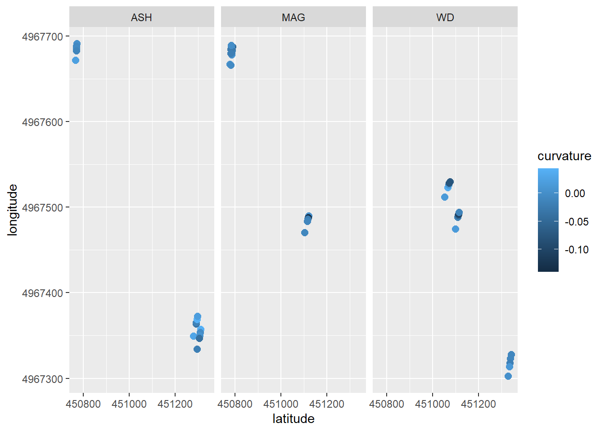

# Erosion pins


## Background

Erosion pins are a simple and inexpensive tool for measuring soil erosion, the removal, and soil deposition, the accumulation, of soil and sediment. They are pervasive in erosion literature: applied from landform to landscape scales, but their implementation varies. Erosion pins are used to study impacts on erosion of vegetation (Asima et al., 2022; Gholami et al., 2020, 2021), slope characteristics (Gholami et al., 2020, 2021; Hancock et al., 2008, 2010; Clarke & Rendell, 2006), and erosion mechanisms (Hadley & Lusby, 1967; Clarke & Rendell, 2006).

Pins are generally installed in a grid pattern (Asima et al., 2022; Kearney et al., 2018; Hancock et al., 2008, 2010; Sirvent et al., 1997) or along a transect (Gholami et al., 2020, 2021; Clarke & Rendell, 2006; Hadley & Lusby, 1967). This divergence in technique reflects differing uses of erosion pin measurements. A grid pattern is often used when estimating average erosion rates over a small area (Asima et al., 2022; Kearney et al., 2018). Transects are common when mapping soil erosion and deposition spatially across a landscape (Gholami et al., 2020, 2021) or studying relationships between hillslope topography and erosion (Clarke & Rendell, 2006; Sirvent et al., 1997). Hancock et al., 2008, 2010 are exceptions in which pins are spaced relatively evenly across a landscape and later grouped by landform for analysis. Hancock et al., 2008 additionally notes the importance of installing pins on similar hillslope positions for consistency. Clarke & Rendell, 2006 measure slope at each individual pin to account differences in slope across a transect.

Study duration and frequency of measurement also vary among studies. Asima et al., 2022, suggests waiting one month after installation before taking the first measurement to account for disturbance. Kearney et al., 2018; Hancock et al., 2008, 2010; and Clarke & Rendell, 2006 report annual measurements over several years. Studies that run for less than two years report sub-annual measurements, often measuring at approximately six-month intervals (Asima et al., 2022; Gholami et al., 2020, 2021; Sirvent et al., 1997). Further, Hadley & Lusby, 1967 uses pins to measure erosion following a single storm event. This diversity reflects the flexibility and breadth of questions erosion pin data can be applied to if the limitations of the method are understood.

A consequence of their simplicity, erosion pins can also provide somewhat unreliable data. Pins may be buried, disturbed by humans and animals, or heaved by frost action. They may be subject to uneven changes on the landscape: gullies, plant growth, or tree throw. Erosion is also a fundamentally complex process governed by many forces and variables like vegetation coverage; slope steepness, length, and complexity; climate; and soil parameters. Several confounding variables can make the application of any erosion monitoring technique unreliable, so often multiple are applied in conjunction. Erosion pins are frequently used with radioisotope measurements (137Cs, 210Pb, 7Be) (Hancock et al., 2008, 2010; Peart et al., 2006), sediment collectors (Asima et al., 2022; Kearney et al., 2018; Sirvent et al., 1997), and modeling (Kearney et al., 2018; Hancock et al., 2008, 2010). Some complementary methods result in similar or complementary data (Asima et al., 2022, Kearney et al., 2018; Peart et al., 2006). However, results between methods do not always agree, with one method under- or over-estimating erosion compared to another (Kearney et al., 2018; Hancock et al., 2008, 2010; Higgitt et al., 1994). Differences stemming from measurement timescale and land-use changes between different methods cannot be avoided, and sometimes, the application of one technique can influence the outcome of another. For example, Higgitt et al., 1994 report that samples for 137Cs, a Cesium isotope, analysis could not be taken from the slope under erosion pin monitoring for fear of introducing human-driven surface creep to the slope. Thus, 137Cs samples were taken from an adjacent slope—but presented somewhat different results than the pins.

The unreliability of the erosion pin method can also be mitigated by replication. Many studies install pins in pairs or groups to allow an average value to be calculated (Asima et al., 2022; Clarke & Rendell, 2006, Hancock and Lowry, 2021, 2023; Kearney et al., 2018). This not only gives statistical power but allows greater flexibility in the removal of outliers in the case of disturbance. Kearney et al., 2018, however, provides a further step to improve the reliability and statistical power of erosion pin measurements—average absolute value. Kearney et al., 2018 demonstrates the effectiveness of this technique in a comparative analysis between slopes under different conditions. The study shows a high correlation between erosion pin absolute value and sediment collectors and modeling methods. This approach, however, is limited in its ability to estimate erosion rates without further data for calibration.

### References

Asima, H., Niedzinski, V., O’Donnell, F. C., & Montgomery, J. (2022). Comparison of Vegetation Types for Prevention of Erosion and Shallow Slope Failure on Steep Slopes in the Southeastern USA. Land, 11(10), 1739. <https://doi.org/10.3390/land11101739>

Clarke, M. L., & Rendell, H. M. (2006). Process–form relationships in Southern Italian badlands: Erosion rates and implications for landform evolution. Earth Surface Processes and Landforms, 31(1), 15–29. <https://doi.org/10.1002/esp.1226>

Gholami, V., Sahour, H., & Hadian Amri, M. A. (2021). Soil erosion modeling using erosion pins and artificial neural networks. CATENA, 196, 104902. <https://doi.org/10.1016/j.catena.2020.104902>

Gholami, V., Sahour, H., & Hadian, M. A. (2020). Mapping soil erosion rates using self-organizing map (SOM) and geographic information system (GIS) on hillslopes. Earth Science Informatics, 13(4), 1175–1185. <https://doi.org/10.1007/s12145-020-00499-w>

Hadley, R. F., & Lusby, G. C. (1967). Runoff and hillslope erosion resulting from a high-intensity thunderstorm near Mack, western Colorado. Water Resources Research, 3(1), 139–143. <https://doi.org/10.1029/WR003i001p00139>

Hancock, G., & Lowry, J. (2021). Quantifying the influence of rainfall, vegetation and animals on soil erosion and hillslope connectivity in the monsoonal tropics of northern Australia. Earth Surface Processes and Landforms, 46(10), 2110–2123. <https://doi.org/10.1002/esp.5147>

Hancock, G. R., & Evans, K. G. (2010). Gully, channel and hillslope erosion – an assessment for a traditionally managed catchment. Earth Surface Processes and Landforms, 35(12), 1468–1479. <https://doi.org/10.1002/esp.2043>

Hancock, G. R., Loughran, R. J., Evans, K. G., & Balog, R. M. (2008). Estimation of Soil Erosion Using Field and Modelling Approaches in an Undisturbed Arnhem Land Catchment, Northern Territory, Australia. Geographical Research, 46(3), 333–349. <https://doi.org/10.1111/j.1745-5871.2008.00527.x>

Hancock, G. R., & Lowry, J. B. C. (2023). Do feral pigs increase soil erosion? A monsoonal northern Australia case study. Earth Surface Processes and Landforms, 48(14), 2828–2841. <https://doi.org/10.1002/esp.5662>

Hancock, G. R., Murphy, D., & Evans, K. G. (2010). Hillslope and catchment scale soil organic carbon concentration: An assessment of the role of geomorphology and soil erosion in an undisturbed environment. Geoderma, 155(1–2), 36–45. <https://doi.org/10.1016/j.geoderma.2009.11.021>

Higgitt, D. L., Walling, D. E., & Haigh, M. J. (1994). Estimating rates of ground retreat on mining spoils using caesium-137. Applied Geography, 14(4), 294–307. [https://doi.org/10.1016/0143-6228(94)90024-8](https://doi.org/10.1016/0143-6228(94)90024-8){.uri}

Kearney, S. P., Fonte, S. J., García, E., & Smukler, S. M. (2018). Improving the utility of erosion pins: Absolute value of pin height change as an indicator of relative erosion. CATENA, 163, 427–432. <https://doi.org/10.1016/j.catena.2017.12.008>

Li, Y., Bai, X., Tian, Y., & Luo, G. (2017). Review and Future Research Directions about Major Monitoring Method of Soil Erosion. IOP Conference Series: Earth and Environmental Science, 63, 012042. <https://doi.org/10.1088/1755-1315/63/1/012042>

Peart, M. R., Ruse, M. E., & Hill, R. D. (2006). A comparison of caesium-137 and erosion pin data from Tai To Yan, Hong Kong. In P. N. Owens & A. J. Collins (Eds.), Soil erosion and sediment redistribution in river catchments: Measurement, modelling and management (1st ed., pp. 28–39). CABI. <https://doi.org/10.1079/9780851990507.0028>

Raiesi, F., & Tavakoli, M. (2022). Developing a soil quality index model for assessing landscape-level soil quality along a toposequence in almond orchards using factor analysis. Modeling Earth Systems and Environment, 8(3), 4035–4050. <https://doi.org/10.1007/s40808-021-01345-8>

Sirvent, J., Desir, G., Gutierrez, M., Sancho, C., & Benito, G. (1997). Erosion rates in badland areas recorded by collectors, erosion pins and profilometer techniques (Ebro Basin, NE-Spain). Geomorphology, 18(2), 61–75. [https://doi.org/10.1016/S0169-555X(96)00023-2](https://doi.org/10.1016/S0169-555X(96)00023-2){.uri}

## Protocol

Updated 06/25/2025

### Installation

1.  Begin by selecting a visually uniform section of the slope. There should be minimal complexity in the \~2 m area of measurement, and vegetation cover should be consistent throughout.

2.  Flag the lower boundary of the footslope.

3.  Starting from this flag, walk up the slope in the steepest direction to the bottom of the shoulder. Measure slope to the bottom flag. Take three steps to the right and measure slope again. Then to the left. Of these three values, the point with the largest value represents the steepest slope. Repeat until you have identified the steepest slope direction. Install a flag here.

4.  Run the measuring tape between the upper and lower flags keeping it as straight as possible.

5.  Identify the center of the footslope (where the slope is the most concave) and the lower backslope. Place a flag at each of these points.

6.  Install the erosion pins to the left and right of the measuring tape centered at these flagged points. Avoid large branches and plant roots, moving the pin slightly closer or further from the tape if necessary. Pins should be installed vertically, NOT perpendicular to the ground surface.

    1.  Install six pins in the center of the footslope, 0.5 m from the tape and 1 m from each other. See diagram.

    2.  Install six pins in the lower half of the backslope, 0.5 m from the tape and 1 m from each other. See diagram.

Note: Erosion pin heights do not need to be collected at installation, as the disturbance at installation makes the measurement unsuitable.

7.  Leave the flags in position for future surveys with a RTK GNSS.

### Measuring

Notes: Pins should not be measured under saturated soil conditions, as swelling in clay-rich soils may influence measurements (Sirvent et al., 1997**)**. If a pin has been obviously disturbed, reinstall it a few centimeters away and record the height, and make note of the disturbance.

1.  Always approach a group of pins from the bottom of the hillslope, and when measuring pins, stay at least 50 cm over to the left or right of the left or right pins, respectively. At no point should you be above or between pins.

2.  Turn on and zero the caliper.

3.  Approach the first pin. Gently clear any debris (leaves, acorns, twigs, etc.) from the surface and rest the washer on the soil around the pin (Sirvent et al., 1997).

4.  Use the vernier caliper to measure the depth from the top of the pin to the washer along one side. Record. Repeat the measurement for the opposite side. The ‘sides’ should be left and right, not upslope and downslope.

Note: If the soil erodes very unevenly, the washer may not accurately reflect the ground surface. If the two sides of the washer differ by more than 10 mm, take an initial measurement of this disturbed condition, then clear the disturbing soil and take another measurement. Make note of which measurement is which. Use your judgment and take pictures.

5.  Repeat for each pin in the transect, then move on to the next group.

When finished, take pictures of datasheets and upload for data entry ([here](https://drive.google.com/drive/folders/1ACcfoafgB9K42wSTWP9lBgOE9dqsDUnh?usp=drive_link)).

## Dataset Building

### Extracting elevation, slope, and curvature from DEMS to GPS points.

Import GPS data points saved in the G-drive (collected using Field Maps and downloaded through Arc Online). Transform into NAD83 zone 15N.


``` r
# load erosion pin points,
arb_gps_raw <- read.csv("G:/My Drive/_data/_erosion_pins/_transect_gps/Erosion_Pin_Transects_1.csv") %>% 
  select(Latitude, Longitude) %>% 
  filter(Latitude < 45) # arb and lr are in the same file, split into 2
  
lr_gps_raw <- read.csv("G:/My Drive/_data/_erosion_pins/_transect_gps/Erosion_Pin_Transects_1.csv") %>% 
  select(Latitude, Longitude) %>% 
  filter(Latitude > 45)

# above points are theoretically in WGS84. this tells r they are (which in R the crs is EPSG: 4326). this also makes them a simple features feature (sf)
arb_gps <- st_as_sf(arb_gps_raw, coords = c("Longitude", "Latitude"), crs = 4326)
lr_gps <- st_as_sf(lr_gps_raw, coords = c("Longitude", "Latitude"), crs = 4326)

# transform from WGS84 to NAD83 zone 15N to match lidar (EPSG: 4269)
arb_NAD <- st_transform(arb_gps, crs = 26915)
lr_NAD <- st_transform(lr_gps, crs = 26915)

lr_NAD <- lr_NAD[-31,] # remove junk point
```

Import dems from drive (created in 26_mapping).


``` r
# lr
lr_1m_dem <- rast("G:/My Drive/_data/_mapping/_lake_rebecca_topo/lr_1m_dem")
lr_1m_slope <- rast("G:/My Drive/_data/_mapping/_lake_rebecca_topo/lr_1m_slope")
lr_1m_curvature <- rast("G:/My Drive/_data/_mapping/_lake_rebecca_topo/lr_1m_curvature")

# arb
arb_1m_dem <- rast("G:/My Drive/_data/_mapping/_arb_topo/arb_1m_dem")
arb_1m_slope <- rast("G:/My Drive/_data/_mapping/_arb_topo/arb_1m_slope")
arb_1m_curvature <- rast("G:/My Drive/_data/_mapping/_arb_topo/arb_1m_curvature")
```

Extract elevation, slope, and curvature (in 1/m) at gps points.


``` r
# arb
arb_NAD$elevation <- terra::extract(arb_1m_dem, arb_NAD)[,2]
arb_NAD$slope <- terra::extract(arb_1m_slope, arb_NAD)[,2]
arb_NAD$curvature <- terra::extract(arb_1m_curvature, arb_NAD)[,2]

# lr
lr_NAD$elevation <- terra::extract(lr_1m_dem, lr_NAD)[,2]
lr_NAD$slope <- terra::extract(lr_1m_slope, lr_NAD)[,2]
lr_NAD$curvature <- terra::extract(lr_1m_curvature, lr_NAD)[,2]
```

Export data sets to drive.


``` r
# export as shape files (.shp)
write_sf(arb_NAD, "G:/My Drive/_data/_erosion_pins/_arb_geo_data_shp/arb_geo_data.shp")
write_sf(lr_NAD, "G:/My Drive/_data/_erosion_pins/_lr_geo_data_shp/lr_geo_data.shp")

# export as tables (.csv)
write.csv(arb_NAD, "G:/My Drive/_data/_erosion_pins/arb_geo_data.csv", quote = 1)
write.csv(lr_NAD, "G:/My Drive/_data/_erosion_pins/lr_geo_data.csv", quote = 1)
```


## Visualizing etc.

### Spatial Plots

Import GPS and dem data.


``` r
# import shape files
arb_geo_shp <- read_sf("G:/My Drive/_data/_erosion_pins/_arb_geo_data_shp/arb_geo_data.shp")
lr_geo_shp <- read_sf("G:/My Drive/_data/_erosion_pins/_lr_geo_data_shp/lr_geo_data.shp")

# import elevation slope curvature data
arb_geo_data <- read.csv("G:/My Drive/_data/_erosion_pins/arb_geo_data.csv")
lr_geo_data <- read.csv("G:/My Drive/_data/_erosion_pins/lr_geo_data.csv")

# merge two above
arb_geo_data[1:2] <- st_coordinates(arb_geo_shp)
arb_geo_data <- rename(arb_geo_data, "latitude" = X, "longitude" = geometry)

lr_geo_data[1:2] <- st_coordinates(lr_geo_shp)
lr_geo_data <- rename(lr_geo_data, "latitude" = X, "longitude" = geometry)

# dems
lr_1m_dem <- rast("G:/My Drive/_data/_mapping/_lake_rebecca_topo/lr_1m_dem")
lr_1m_slope <- rast("G:/My Drive/_data/_mapping/_lake_rebecca_topo/lr_1m_slope")
lr_1m_curvature <- rast("G:/My Drive/_data/_mapping/_lake_rebecca_topo/lr_1m_curvature")

arb_1m_dem <- rast("G:/My Drive/_data/_mapping/_arb_topo/arb_1m_dem")
arb_1m_slope <- rast("G:/My Drive/_data/_mapping/_arb_topo/arb_1m_slope")
arb_1m_curvature <- rast("G:/My Drive/_data/_mapping/_arb_topo/arb_1m_curvature")
```

Plotting fun


``` r
arb_geo_data$site = NA
arb_geo_data[1:15,]$site = "ASH"
arb_geo_data[16:30,]$site = "MAG"
arb_geo_data[31:45,]$site = "WD"

ggplot(arb_geo_data, mapping = aes(latitude, longitude, group = site, color = curvature)) +
  geom_point(size = 2.5) +
  facet_wrap(~site)
```


