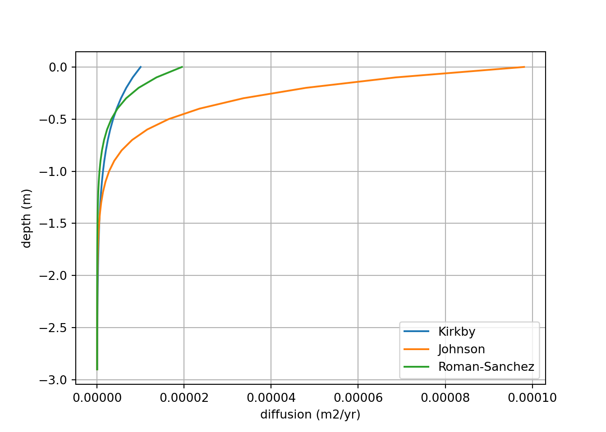
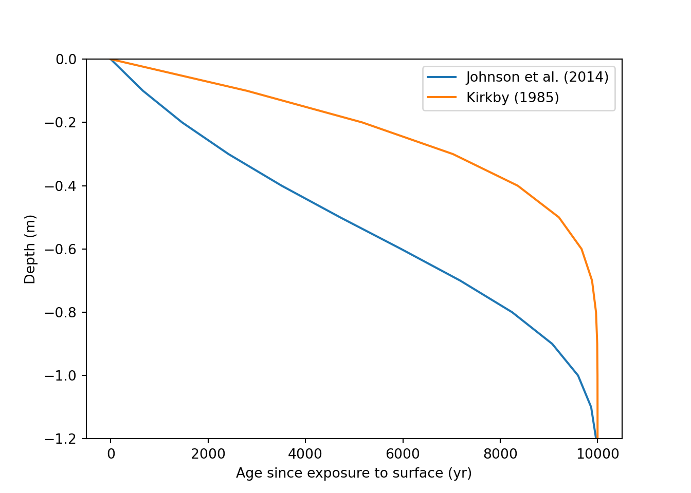
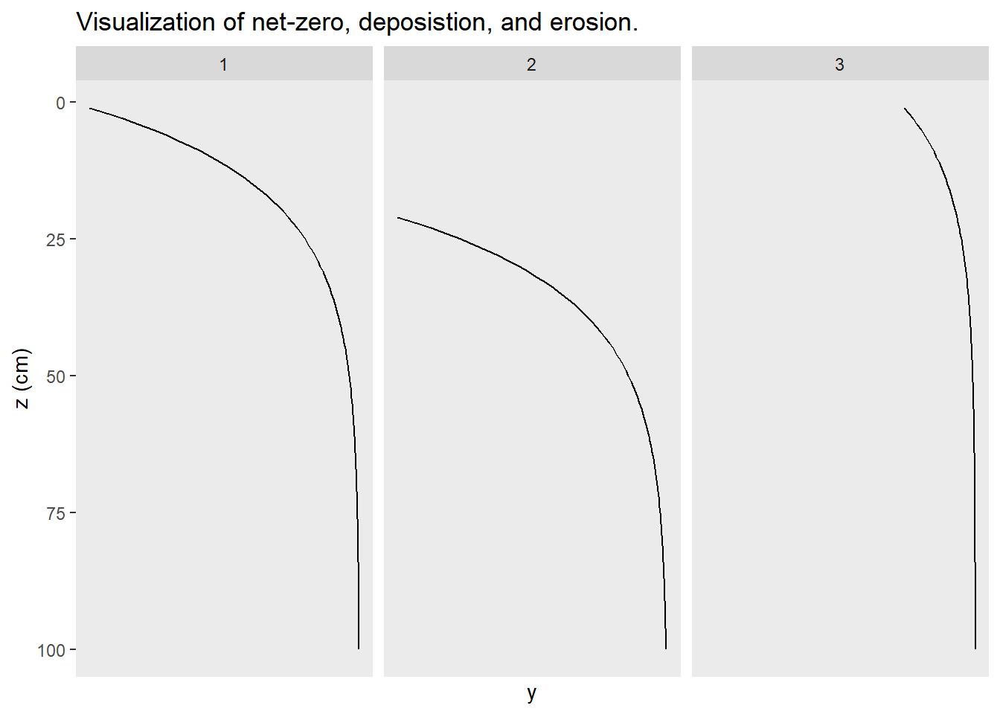

## Models and Code


*This first code chunk defines the shared structures and variables used by the following code chunks. It has no outputs itself.*


``` python

# build structures for data inputs. These do not get overwritten.
dz = 0.1 # m
z = np.arange(0, 3, dz, dtype=float) # create an array of depths
y = np.zeros(z.shape, dtype=float) # create a blank array for y, copies shape of z
p = np.zeros(z.shape, dtype=float)# create a blank array for p, copies shape of z

# [set] initial p values
p += 1 # mass soil / volume soil

# [set] total time
total_time = 10000 # years

# [set] erosion/denudation rate. erosion (-)
T = 0 # m / yr

# Define the exponential diffusion equation
def D(z, D0, zb):
    return D0 * np.exp(-z/zb) # in m2/yr

# adjust timestep size
dt = 0.2 * dz**2 / 10**(-3) # sets time step size, based on Courant–Friedrichs–Lewy condition. Currently a general, low value
time_steps = int(total_time / dt) # calculates total number of time steps


def OSL_plt_defaults():
  plt.ylim(-1.2, 0)
  plt.legend()
  plt.xlabel('Age since exposure to surface (yr)')
  plt.ylabel('Depth (m)')
  plt.show()
```

*This code plots the differing exponential D(z) equations.*



*This code uses the above the equations to simulate an age profile of soil grains created by biodiffusion, local mixing, only.*


``` python
# define OSL diffusion only function
def OSL_diffusion(z, y, p, dz, dt, T, D):
  y_copy = y.copy()
  for i in range(time_steps):
    qy = -1 * D[0:-1] * np.diff(y_copy * p) / dz
    diff = -1 * np.diff(qy) / dz
    advec = T * -np.diff(y_copy * p) / dz
    dydt = diff + advec[0:-1] + 1 
    y_copy[1:-1] += dydt * dt
  return y_copy

Johnson = OSL_diffusion(z, y, p, dz, dt, T, D(z, 9.81 * 10**(-5), 0.28))
Kirkby = OSL_diffusion(z, y, p, dz, dt, T, D(z, 10**(-5), 0.50))


plt.clf()
plt.plot(Johnson, -z, label = "Johnson et al. (2014)")
plt.plot(Kirkby, -z, label = "Kirkby (1985)")
OSL_plt_defaults()
```



*This code generates a visualization of the impact of erosion on a theoretical tracer profile. 1) tracer profile at steady state, 2) tracer profile moves downwards under deposition, and 3) tracer profile moves upwards under erosion. Soil surface at z = 0.*



*This code adds advection, by erosion and deposition, to the model.*


``` python
T1 = OSL_diffusion(z, y, p, dz, dt, 0, D(z, 9.81 * 10**(-5), 0.28))
T2 = OSL_diffusion(z, y, p, dz, dt, -0.00005, D(z, 9.81 * 10**(-5), 0.28))
T3 = OSL_diffusion(z, y, p, dz, dt, -0.0001, D(z, 9.81 * 10**(-5), 0.28))
T4 = OSL_diffusion(z, y, p, dz, dt, 0.00005, D(z, 9.81 * 10**(-5), 0.28))
T5 = OSL_diffusion(z, y, p, dz, dt, 0.00001, D(z, 9.81 * 10**(-5), 0.28))

plt.clf()
plt.plot(T1, -z, label = "T = 0", color = "Black")
plt.plot(T2, -z, label = "T = -0.00005", linestyle='--')
plt.plot(T3, -z, label = "T = -0.0001", linestyle='--')
plt.plot(T4, -z, label = "T = 0.00005", linestyle='--')
plt.plot(T5, -z, label = "T = 0.0001", linestyle='--')
OSL_plt_defaults()
```


*This code uses the above function to do some "tracer" plotting with different deposition values.*


``` python
# define OSL diffusion, with a tracer, function
def local_diffusion(z, y, p, dz, dt, T, D):
  y_copy = y.copy()
  for i in range(time_steps):
    qy = -1 * D[0:-1] * np.diff(y_copy * p) / dz
    diff = -1 * np.diff(qy) / dz
    advec = T * -np.diff(y_copy * p) / dz
    dydt = diff + advec[0:-1]
    y_copy[1:-1] += dydt * dt
  return y_copy

smart0 = local_diffusion(z, y, p, dz, dt, 0, D(z, 9.81 * 10**(-5), 0.28))
smart = local_diffusion(z, y, p, dz, dt, 0.00001, D(z, 9.81 * 10**(-5), 0.28))
smart2 = local_diffusion(z, y, p, dz, dt, 0.0001, D(z, 9.81 * 10**(-5), 0.28))
smart3 = local_diffusion(z, y, p, dz, dt, 0.001, D(z, 9.81 * 10**(-5), 0.28))

plt.clf()
plt.plot(y, -z, label = "original", color = "Black", linestyle='--')
plt.plot(smart0, -z, label = "T = 0", color = "Black")
plt.plot(smart, -z, label = "T = +0.00001", linestyle='--')
plt.plot(smart2, -z, label = "T = +0.0001", linestyle='--')
plt.plot(smart3, -z, label = "T = +0.001", linestyle='--')
OSL_plt_defaults()
```


*This code does the above equation*


``` pyhton

# [set] initial y values
yi = y.copy()
yi[z == 0] += 1 # mass or activity y / mass soil

# [set] initial p values
pi = p.copy()
pi += 1 # mass soil / volume soil


# define isotope local diffusion function, constant D
def local_diffusion(z, yi, p, dz, dt, T, D):
  y_copy = y.copy()
  for i in range(time_steps):
    qy = -1 * D[0:-1] * np.diff(y_copy * p) / dz
    diff = -1 * np.diff(qy) / dz
    advec = T * -np.diff(y_copy * p) / dz
    dydt = diff + advec[0:-1]
    y_copy[1:-1] += dydt * dt
  return y_copy

```
